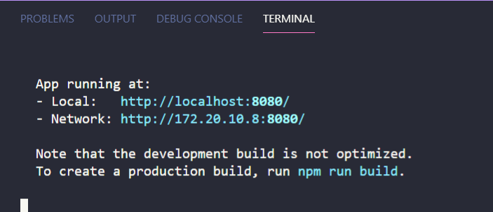

# <div align="center">gitsocial</div>

### <div align="center">Taking GitHub to the moon 🚀</div>

<div align="center">https://gitsocial.vercel.app/</div>

<div align="center">Browse GitHub like you are browsing Facebook. Turning GitHub into a social network for developers.</div>

[CODE OF CONDUCT](CODE_OF_CONDUCT.md) · [Community](https://community) · [Documentation](https://documentation)

<!-- Not sure what this does, can we delete it or update it. -->

## Structure


| Codebase | Description |
| :- | :-: |
| root | Front-end |

## How to run locally

#### Get repo/project on your machine

```
git clone https://github.com/FotieMConstant/gitsocial
```

#### Install all required packages

```bash
cd gitsocial

npm install
```

#### Run project locally

```bash
npm run serve
```

Open your browser and go to [localhost:8080]

Or follow the link to localhost within your terminal after you have succesfully run the`npm run serve` command.



Also check the [CONTRIBUTING.md](https://github.com/FotieMConstant/gitsocial/blob/staging/CONTRIBUTING.md) on how to contribute before proceeding.

## Contributions

gitsocial is open to contributions, however we highly recommend creating an issue or replying in a comment to let us know what you are working on first. That way we won't overwrite each other.

Please read [CONTRIBUTING.md](CONTRIBUTING.md) for details on this project.

## Code of Conduct

Please read [CODE\_OF\_CONDUCT.md](CODE_OF_CONDUCT.md) for details on our code of conduct.

## Why we made this?

Who else has ever fantasized about having a clean UI like GitHub's but on a social network ? Well we have and it's why we are building gitsocial; the ability to browse through repos styled with elegant cards.:grin:, scroll through pages smoothly, move from page to page while barely noticing the change. This is what we want to embed in gitsocial; that "GitHub feeling". We're using the [GitHub API](https://docs.github.com/en/rest) for the data to borrow that feel.

If you have fantasized about it or like the idea, you're welcome to join us. Let us make this happen:sunglasses:
